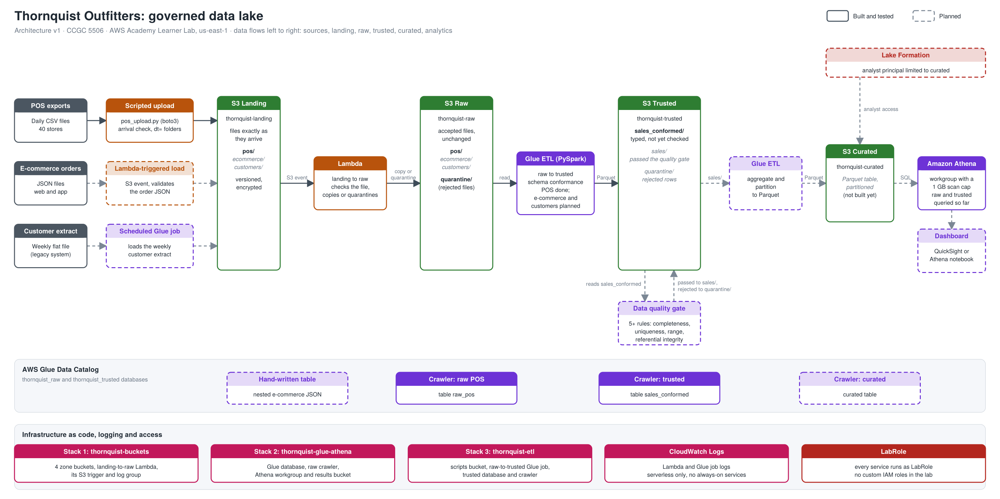

# Thornquist Outfitters: Governed Data Lake

CCGC 5506 mid-term project (Fall 2026). A four-zone S3 data lake for a fictional
multi-channel outdoor-gear retailer, built to run inside an AWS Academy Learner Lab.

All data is synthetic (generated by `scripts/generate_mock_data.py`). No real
personal data is used anywhere.

## Architecture



Flow: sources, S3 landing, a validation Lambda, S3 raw, a Glue ETL job that conforms
the schema, S3 trusted, a data quality gate, a Glue ETL job that aggregates, S3 curated
(Parquet), then Athena and a dashboard. Glue crawlers register each zone in the Glue
Data Catalog. Solid boxes in the diagram are built and tested; dashed boxes are planned.
An editable copy is in `docs/thornquist-architecture-v1.drawio`.

## Status

| Piece | Status |
|---|---|
| Four S3 zones, versioning, encryption, public access blocked (IaC) | Built, tested |
| Scripted POS upload to landing | Built, tested |
| Landing to raw promotion Lambda, with quarantine | Built, tested |
| Glue database, crawler and Athena workgroup for raw POS | Built, tested |
| Raw to trusted Glue ETL for POS (schema conformance) | Built, tested |
| Trusted database and crawler (`sales_conformed`) | Built, tested |
| E-commerce JSON ingestion (Lambda) and hand-written table definition | Planned |
| Customer extract ingestion (scheduled Glue job) | Planned |
| Raw to trusted ETL for e-commerce and customers | Planned |
| Data quality gate with quarantine | Planned |
| Curated Parquet table, five Athena queries, dashboard | Planned |
| Governance package (IAM policy JSON, bucket policy, Lake Formation) | Planned |

## Repository layout

```
docs/
  thornquist-architecture-v1.png     Architecture diagram (also .svg and editable .drawio)
infra/
  thornquist-buckets.yaml            Stack 1: four zone buckets + landing-to-raw Lambda and trigger
  thornquist-glue-athena.yaml        Stack 2: Glue database, CSV classifier, raw crawler, Athena workgroup
  thornquist-etl.yaml                Stack 3: scripts bucket, raw-to-trusted Glue job, trusted database and crawler
glue/
  raw_to_trusted_pos.py              PySpark job: raw POS CSV to conformed sales Parquet
scripts/
  generate_mock_data.py              Creates the synthetic POS, e-commerce and customer files
  pos_upload.py                      Uploads POS CSVs to landing (ingestion mechanism 1)
```

## Zone design and promotion rules

| Zone | Bucket | Holds | Enters when |
|---|---|---|---|
| Landing | `thornquist-landing-<suffix>` | Files exactly as they arrive | A source delivers a file |
| Raw | `thornquist-raw-<suffix>` | Accepted files, byte-for-byte unchanged | The file opens, is not empty, has the expected header and at least one data row |
| Trusted | `thornquist-trusted-<suffix>` | `sales_conformed/`: typed rows in the shared schema. `sales/` and `quarantine/`: planned output of the quality gate | Conformed by the Glue job; promoted to `sales/` only after the quality gate (planned) |
| Curated | `thornquist-curated-<suffix>` | Aggregated, partitioned Parquet for analytics | Planned |

Files that fail the landing-to-raw check go to `quarantine/` in the raw bucket
with the reason stored in the object's `reject-reason` metadata. The crawler only
reads `pos/`, so quarantined files never become table data.

All buckets use versioning (so raw cannot be silently overwritten), AES-256
encryption, blocked public access, a TLS-only policy, and a lifecycle rule that
deletes old object versions after 30 days to protect the shared lab budget.

## Trusted schema (the contract with the quality gate)

The raw to trusted job writes one conformed table, `sales_conformed`, shared by all
channels. It converts types and formats but never drops, de-duplicates or repairs
records. A value that cannot be converted becomes NULL and its column name is listed in
`parse_errors`. The quality gate reads this table, applies its rules, writes passing rows
to `sales/` and rejected rows to a quarantine folder.

| Column | Type | Notes |
|---|---|---|
| `sale_id` | string | POS `txn_id` (e-commerce: order ID plus line number, planned) |
| `channel` | string | `store`, `web` or `app` |
| `sale_date` | date | NULL if the source date is invalid |
| `customer_id` | string | 6 digits, no prefix; NULL for walk-in customers |
| `sku` | string | `TH-<digits>` |
| `product_name` | string | |
| `category` | string | Blank becomes NULL; placeholders such as `UNKNOWN` are kept for the gate |
| `quantity` | int | NULL if not numeric; zero and negative values are kept for the gate |
| `unit_price_cad` | decimal(10,2) | NULL if not numeric; zero and negative values are kept for the gate |
| `province` | string | Two-letter code |
| `store_id` | string | |
| `parse_errors` | string | Comma-separated names of columns that could not be converted; NULL when clean |
| `source_file` | string | Raw file the row came from |
| `ingested_at` | timestamp | |
| `dt` | string | Partition: the landing date folder |

The job reads all of raw on every run and overwrites its output, so running it twice
gives the same result.

## Learner Lab constraints and how the design handles them

- **No custom IAM roles.** The templates create no IAM resources. Every Lambda, Glue job
  and crawler uses the existing `LabRole`, passed in as the `LabRoleArn` parameter.
  The least-privilege policy will be written as a JSON document (not deployed).
- **Lockdown option.** `EnableZoneLockdown` (default `false`) adds a bucket policy
  that denies everyone except `LabRole` (and `AdminPrincipalArn`) on landing and
  raw. Before turning it on, set `AdminPrincipalArn` to the role your own lab
  login uses (`aws sts get-caller-identity`, then convert the assumed-role ARN to
  `arn:aws:iam::<account>:role/<role>`), or you can lock yourself out.
- **Short sessions and resets.** Everything is rebuilt from this repo; nothing
  depends on console-only state.
- **Budget.** Serverless services only. The Athena workgroup cancels any query
  scanning more than 1 GB, query results expire after 7 days, and the Glue job runs
  on 2 workers with a 15-minute timeout.
- **Region.** `us-east-1`.

## Reproduce from a fresh Learner Lab session

Replace `<suffix>` with 2 to 12 lowercase letters or digits that are unique to
you (bucket names are global). Use the same suffix in all three stacks.

### 0. Prerequisites

- Python 3 and `pip install boto3`
- Lab credentials in `~/.aws/credentials` (Learner Lab page: **AWS Details** then
  **AWS CLI: Show**). They expire when the session ends, so refresh them each time.
- Your LabRole ARN: IAM console, Roles, `LabRole`, copy the ARN.

### 1. Deploy stack 1 (buckets and promotion Lambda)

CloudFormation console: **Create stack, With new resources**, upload
`infra/thornquist-buckets.yaml`, name it `thornquist-<suffix>`, and set
`Suffix` and `LabRoleArn`. Leave the other parameters at their defaults.
Wait for `CREATE_COMPLETE`.

### 2. Generate and upload the POS data

```
python3 scripts/generate_mock_data.py --out mock_data
python3 scripts/pos_upload.py --bucket thornquist-landing-<suffix> --source-dir mock_data/pos --region us-east-1 --dry-run
python3 scripts/pos_upload.py --bucket thornquist-landing-<suffix> --source-dir mock_data/pos --region us-east-1
```

The generator is seeded, so everyone gets identical files. `mock_data/_INJECTED_ISSUES.txt`
lists every deliberate data problem and the exact count. The upload script rejects
the two intentionally broken POS files locally. To see the Lambda quarantine them,
upload them directly:

```
aws s3 cp mock_data/pos/pos_2026-10-01.csv s3://thornquist-landing-<suffix>/pos/dt=2026-10-01/pos_2026-10-01.csv
aws s3 cp mock_data/pos/pos_2026-10-02.csv s3://thornquist-landing-<suffix>/pos/dt=2026-10-02/pos_2026-10-02.csv
```

### 3. Check promotion

After about 30 seconds, `thornquist-raw-<suffix>/pos/` should hold 14 dated
folders and `quarantine/pos/` should hold the 2 rejected files. Logs are in
CloudWatch under `/aws/lambda/thornquist-landing-to-raw-<suffix>`.

### 4. Deploy stack 2 (catalog and Athena)

Create a second stack from `infra/thornquist-glue-athena.yaml`, named
`thornquist-<suffix>-glue`, with the same `Suffix` and your `LabRoleArn`.

### 5. Crawl and query raw

Run the crawler `thornquist-raw-pos-<suffix>` (Glue console, or
`aws glue start-crawler --name thornquist-raw-pos-<suffix>`). In Athena, choose
workgroup `thornquist-<suffix>` and database `thornquist_raw`:

```sql
SELECT dt, COUNT(*) AS row_count FROM raw_pos GROUP BY dt ORDER BY dt;
```

### 6. Deploy stack 3 and run the raw to trusted job

Create a third stack from `infra/thornquist-etl.yaml`, named `thornquist-<suffix>-etl`, with
the same `Suffix` and `LabRoleArn`. Then upload the job script (the exact command is also
in the stack's **Outputs** tab as `UploadScriptCommand`), start the job, and crawl the result:

```
aws s3 cp glue/raw_to_trusted_pos.py s3://thornquist-scripts-<suffix>/glue/raw_to_trusted_pos.py
aws glue start-job-run --job-name thornquist-raw-to-trusted-pos-<suffix>
aws glue start-crawler --name thornquist-trusted-<suffix>
```

When the job run shows **Succeeded** (about 1 to 2 minutes), its output log contains
`Read and wrote 2734 rows`. After the crawler finishes, in Athena choose database
`thornquist_trusted`:

```sql
SELECT * FROM sales_conformed LIMIT 10;
SELECT parse_errors, COUNT(*) AS rows FROM sales_conformed GROUP BY parse_errors;
```

With the default mock data this shows 29 rows with `sale_date`, 13 with `unit_price`
and the rest clean.

## Tear down

1. Delete stack `thornquist-<suffix>-etl` (empty the `thornquist-scripts-<suffix>` bucket first).
2. Delete stack `thornquist-<suffix>-glue` (empty the `thornquist-athena-results-<suffix>` bucket first).
3. Empty each of the four zone buckets using the S3 console **Empty** button, which also removes old object versions.
4. Delete stack `thornquist-<suffix>`.

CloudFormation cannot delete a bucket that still contains objects or versions.

## Schema conflicts and how they are reconciled

The mock sources disagree on purpose, so the raw to trusted job has real conflicts
to reconcile:

| Field | POS | E-commerce | Customers | Conformed form | Done for |
|---|---|---|---|---|---|
| Date | `MM/DD/YYYY` | ISO 8601 with timezone | `DD-MON-YY` | `date`; invalid becomes NULL | POS |
| Customer ID | `L000123` | integer `123` | `000123` | 6-digit string | POS |
| Category | `Footwear` | `Shoes > Hiking Boots` | n/a | Shared category list (mapping table planned) | Planned |
| SKU | `TH-1001` | `TH1001` | n/a | `TH-1001` | POS |
| Price | dollars as text | integer cents, some USD | n/a | `decimal(10,2)` in CAD | POS (dollars only) |
| Province | `ON` | `ON` | `Ontario` | Two-letter code | POS |

## Known limitations

- The combined stack 1 template (buckets plus Lambda) has been applied as an update to
  an existing stack and the result tested. A first-time create from an empty account
  follows the same dependency order, but has not yet been verified end to end.
- The landing trigger covers `.csv` files under `pos/` only. Other sources will add
  their own trigger rules.
- The Lambda requires the exact POS header set by the `PosExpectedHeader` parameter.
- The Glue job reads only `pos/dt=*/` folders, so files placed in `pos/undated/` are ignored.
- The job is a full refresh of all POS data, not an incremental load.
- Duplicate rows, zero or negative quantities and prices, placeholder categories and
  unknown customer IDs pass through to `sales_conformed` on purpose; the quality gate handles them.

## Team

- `<name>`: ingestion, catalog, raw to trusted ETL
- `<name>`: data quality gate, curated layer, governance, dashboard
